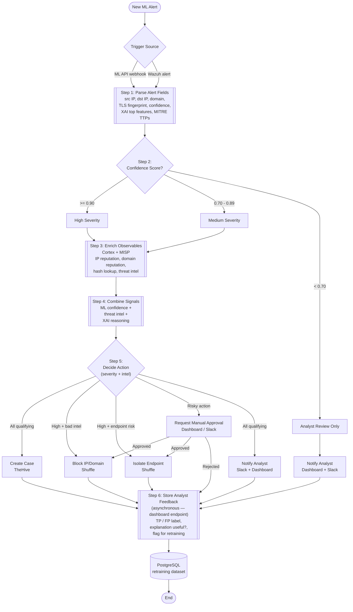

# SOAR Workflow Specification
**Module:** `services/soar_orchestrator`
**Purpose:** Orchestration logic that consumes annotated ML alerts and drives the SOAR response stack (TheHive, Cortex+MISP, Shuffle, optionally Wazuh).
**Audience:** Claude Code (implementation), Shuffle (workflow import reference).

---

## 1. Overview

The SOAR module consumes annotated detection alerts and orchestrates enrichment, case
management, and response actions. The orchestration logic is implemented in two layers:

1. **`soar_orchestrator` service** (Python) — **polls** the shared PostgreSQL `alerts`
   table (written by the detection/translator pipeline), applies severity logic, calls
   Cortex/MISP, creates TheHive cases, runs the §5 decision matrix, persists state, and
   hands the action directive to Shuffle.
2. **Shuffle workflow** — visual automation for response actions (block, isolate, notify)
   and the manual approval gate.

This document specifies the end-to-end logic. The decision matrix in **Section 5** is
authoritative — implement those rules exactly.

### Deployment topology (current)

The two halves run on **separate machines** and integrate **only** through the shared
Postgres `alerts` contract:

- **Detection machine** — runs the producer/inference/translator pipeline and **owns the
  Postgres** (`alerts` table). Postgres publishes `5432`, firewalled to the SOAR host.
- **SOAR machine** — runs `soar_orchestrator` alongside the vendored TheHive/Cortex/MISP/
  Shuffle stacks (`deploy/soar/`, managed by `scripts/soarctl.sh`). The orchestrator reads
  the detection Postgres **cross-machine** (`DATABASE_URL → <DETECTION_HOST>:5432`) and
  reaches the local SOAR stack over the host's published ports. It is **not** part of the
  detection compose; start it with `scripts/soarctl.sh start orchestrator`. See
  `deploy/soar/orchestrator/README.md`.

---

## 2. Component Roles

| Component | Role |
|---|---|
| **Translator service** | Produces annotated alert: confidence, XAI top features, MITRE TTPs, observables. Source of the trigger. |
| **soar_orchestrator** | Parses alert, applies severity logic, calls Cortex, creates TheHive cases, persists state. |
| **TheHive** | Case management — one case per qualifying alert, with tasks and observables. |
| **Cortex + MISP** | Observable enrichment — IP/domain reputation, hash lookup, threat intel correlation. |
| **Shuffle** | Response orchestration — block, isolate, notify, and the manual approval pause gate. **Block/isolate are currently safe no-op placeholders** (recorded, never enacted — no real firewall/EDR); see §7.2. |
| **Wazuh** (optional) | Endpoint log analysis and additional context for hosts in flagged flow sessions. Alternative trigger source. **Currently dormant** — the "endpoint risk / isolate" path is therefore inactive. |
| **Dashboard** | Analyst interface — notifications, manual approval responses, and feedback labelling (Step 6). Step 6 currently lands on the orchestrator's interim `/soar/feedback` endpoint pending the dashboard owning it. |
| **PostgreSQL** | Persistent store — alerts, enrichment results, analyst decisions, retraining labels. **Owned by the detection machine**; the orchestrator reads/writes it cross-machine. |

---

## 3. Trigger

**Current implementation: the orchestrator polls the shared Postgres `alerts` table.**
On an interval (`POLL_INTERVAL_SEC`) it calls `pick_next_alert(...)` for new rows where
`model='XGBoost' AND tier='fast'`, marks each `running` in its own bookkeeping table
(idempotent), and runs Steps 1–5 synchronously per alert. There is no inbound webhook to
the orchestrator — the detection side only writes rows; the SOAR side pulls them.

(Design alternative, not used: a translator/Wazuh push webhook. A **Wazuh** rule match
remains a possible future trigger source, but Wazuh is dormant today.)

The "trigger payload" is the annotated alert row itself (see Step 1 fields).

---

## 4. Workflow Steps

### Step 1 — Parse Alert Fields

**Source of truth = the shared PostgreSQL `alerts` table** (written by the translator, one
row per flagged flow where `model='XGBoost' AND tier='fast'`). Field names below are the
actual column names — read them directly; do not rename. Full contract + producer-side
detail in `context/SYSTEM_OVERVIEW.md`.

- `flow_id` — flow identity
- `pred_proba` — **this is `model_confidence`**, P(malicious) ∈ [0,1] (drives Step 2)
- `pred_label` — 0 benign / 1 malicious
- `observables` (JSONB) — `[{type, value, role}]`; `type ∈ {ip, domain, url, ja3}`,
  `role ∈ {src, dst}`. **`ja3`** carries the TLS client fingerprint (NFStream
  `client_fingerprint`); `server_fingerprint` (JA3S) may also appear. Route to Cortex/MISP
  by `type` (see Step 3).
- `top_k_json` (JSONB) — `xai_top_features`: top-k `[{feature, value, contribution, direction}]`
- `mitre_ttps`, `mitre_names` (JSONB) — mapped ATT&CK technique IDs / names
- `mapping_confidence` (float), `mapping_status` (`mapped`/`unmapped_heuristic`/`unmapped`),
  `mapping_version` — **trust signal for the feature→TTP mapping** (used in Step 4)
- `severity`, `severity_label` — translator's *advisory* severity (see Step 2)
- `annotation` — human-readable SOC explanation

### Step 2 — Severity Classification
The **orchestrator is the authoritative source of severity**, derived from `pred_proba`
(`model_confidence`). The translator's `severity_label` column is *advisory only* — do not
branch on it; recompute here so there is a single source of truth:

| `pred_proba` (model_confidence) | Severity |
|---|---|
| `>= 0.90` | **High** |
| `0.70 – 0.89` | **Medium** |
| `< 0.70` | **Analyst review only** |

> Note: the translator currently labels severity with a different threshold (≥0.85 = HIGH).
> That mismatch is intentional/known — the orchestrator's thresholds above win.

### Step 3 — Enrich Observables (Cortex + MISP)
For High and Medium severity only. Iterate `observables` and route each to its analyzers
by `type` (analyzer lists are in `integration_config.py`):
- `ip` → IP reputation (src and dst)
- `domain` → domain reputation
- `url` → URL analyzers
- `ja3` → **TLS-fingerprint correlation** (MISP `ja3-fingerprint-md5`; malware families
  reuse client JA3s, so this catches encrypted C2 even when IP/domain are clean/rotating)
- file hash, if present → hash lookup
- MISP threat-intel correlation across all of the above

Record the enrichment verdict: `intel_malicious` (bool) and `intel_score`.

**Analyst-review-only (Low) alerts skip enrichment** — they go straight to notification.

### Step 4 — Combine Signals
Compute a combined decision input from:
- `model_confidence` (ML signal)
- `intel_malicious` / `intel_score` (threat intel signal)
- `xai_top_features` + `mitre_ttps` (explanation context)
- `mapping_confidence` / `mapping_status` (**mapping trust signal**) — when
  `mapping_status != "mapped"` or `mapping_confidence` is low, treat the assigned
  `mitre_ttps` as tentative: surface them in the case but do not let an unvalidated TTP
  alone justify an automated block.

This combined view drives Step 5.

### Step 5 — Decide Action
Apply the **Decision Matrix** below. This is authoritative.

### Step 6 — Store Analyst Feedback (asynchronous)
**This is NOT part of the Shuffle detection workflow.** It is a separate endpoint, invoked
later when an analyst reviews the alert. Persists:
- `true_positive` / `false_positive` label
- `explanation_useful` (bool)
- `flag_for_retraining` (bool)

This data feeds the retraining dataset.

**Current implementation:** a minimal `POST /soar/feedback` route on the orchestrator's
`api_server` writes to an **interim** orchestrator-owned table (`soar_analyst_feedback`,
columns named to match the shared Step-6 schema). The shared `alerts` table now carries the
Step-6 columns (`explanation_useful`, `flag_for_retraining`, `true_positive/false_positive`);
the interim table will be retired once the **dashboard** owns Step 6 and writes those
columns directly. Step 6's real home is the dashboard — the orchestrator route is a stopgap.

---

## 5. Decision Matrix (Step 5 — AUTHORITATIVE)

| Severity | Cortex/MISP verdict | Actions |
|---|---|---|
| **High** | Malicious IOC confirmed | Auto-block IP/domain (Shuffle) + create case (TheHive) + notify (Slack + Dashboard) |
| **High** | No IOC confirmation | Create case (TheHive) + **request manual approval** before block/isolate + notify |
| **High** | Endpoint risk flagged (Wazuh) | Request manual approval for **isolate endpoint** + create case + notify |
| **Medium** | Any | Create case (TheHive) + notify (Slack + Dashboard). No automated block. |
| **Low** | (enrichment skipped) | Notify analyst only (Dashboard + Slack). No case, no response action. |

### Action definitions
- **Create case (TheHive)** — orchestrator calls TheHive API, attaches observables, MITRE TTPs as procedures, and renders the playbook as tasks.
- **Auto-block IP/domain (Shuffle)** — Shuffle firewall/block-rule app. Fires automatically only in the High + confirmed-IOC case.
- **Isolate endpoint (Shuffle)** — Shuffle containment app. **Always gated behind manual approval.**
- **Notify (Shuffle)** — Slack message + dashboard notification.
- **Request manual approval (Dashboard)** — see Section 6.

---

## 6. Manual Approval Gate (CRITICAL implementation note)

Risky actions (**block**, **isolate**) must NOT fire automatically except in the single auto-block case defined in the matrix. All other block/isolate actions route through a **human approval pause**.

In Shuffle this is implemented with a **User Input trigger node** that:
1. Pauses the workflow.
2. Sends an approval request (with alert context) to the configured channel.
3. Waits for an `approve` / `reject` response.
4. On `approve` → execute the block/isolate action.
5. On `reject` → the action is **not** executed.

Do not generate a fully automated flow with no human gate for isolate actions.

**Implementation reality (verified against the live Shuffle):** the User Input node is
**binary** — *approve* continues to the enforcement branch; *reject* (abort) **terminates
the whole workflow run**, which is the safe default (no enforcement happens). Shuffle does
**not** run a downstream "rejected" branch, so the rejection is **not** logged from inside
the workflow. The rejection is instead captured by (a) the orchestrator's **pre-dispatch
record** — the gated action is persisted with `requires_approval: true` in the alert's
`playbook_plan` before hand-off — and (b) the **absence** of an "executed" outcome on the
`callback_url`. A richer in-workflow "rejected → log" path would require a Shuffle User-Input
*decline subflow* (a follow-up, not built). The §7.1 `reject → log, skip` contract therefore
holds for **skip** (enforcement never fires); the **log** lives on the orchestrator side, not
in Shuffle.

---

## 7. Implementation Boundaries (for Claude Code)

- **Synchronous detection workflow:** Steps 1–5 run in one pass when an alert arrives.
- **Asynchronous feedback:** Step 6 is a separate dashboard endpoint writing to PostgreSQL. It may be invoked hours after detection. Do NOT make the Shuffle workflow wait for it.
- **soar_orchestrator owns:** alert parsing, severity logic, Cortex calls, TheHive case creation, persistence.
- **Shuffle owns:** block, isolate, notify actions, and the approval pause gate.
- **The orchestrator triggers Shuffle** via Shuffle's **workflow-run API**, not a webhook:
  `POST {SHUFFLE_BASE_URL}/api/v1/workflows/{SHUFFLE_WORKFLOW_ID}/run` with header
  `Authorization: Bearer {SHUFFLE_API_KEY}` and the §7.1 payload as the JSON-string
  `execution_argument`. (A webhook trigger was evaluated but its activation couldn't be
  confirmed headlessly; the `/run` API was verified end-to-end against the live instance.)
  Config lives in the orchestrator `.env` (`SHUFFLE_BASE_URL`, `SHUFFLE_WORKFLOW_ID`,
  `SHUFFLE_API_KEY`). The importable workflow + notes are in
  `services/soar_orchestrator/shuffle/`.

---

## 7.1 Orchestrator → Shuffle Handoff Payload (AUTHORITATIVE)

This is the contract for the chosen architecture: the orchestrator runs Steps 1–4 and the
decision matrix (Step 5), creates the TheHive case, then hands this payload to Shuffle via
the workflow-run API (§7, as the `execution_argument`). **Shuffle executes the `actions`
directive as given — it does NOT re-derive severity, re-run the matrix, or re-run Cortex.**
The orchestrator is the single source of truth for the decision; Shuffle is the action layer.

The payload also carries flat, top-level **action-hint booleans** (`block_present`,
`block_requires_approval`, `isolate_present`, `isolate_requires_approval`, `notify_present`),
derived from `actions`, purely so Shuffle's branch nodes have simple booleans to route on
instead of parsing the `actions` array. `actions` stays authoritative — the hints are always
recomputed from it.

```jsonc
{
  "schema_version": "1.0",
  "alert": {
    "flow_id": "…",
    "severity": "High | Medium | Low",
    "model_confidence": 0.94,          // = pred_proba
    "mitre_ttps": ["T1071", "T1071.001"],
    "mapping_status": "mapped",        // mapped | unmapped_heuristic | unmapped
    "mapping_confidence": 0.87,
    "annotation": "…",                 // SOC explanation for approval/notify context
    "intel": { "intel_malicious": true, "intel_score": 0.0 }  // Cortex/MISP verdict (Step 3)
  },
  "case": {                            // TheHive case already created by the orchestrator
    "thehive_case_id": "~12345",
    "thehive_case_url": "https://thehive/cases/~12345"
  },
  "observables": [                     // enriched; used as block targets + approval/notify context
    { "type": "ip",     "value": "203.0.113.7", "role": "dst", "intel_malicious": true },
    { "type": "domain", "value": "bad.example",  "role": "dst" },
    { "type": "ja3",    "value": "e7d705a3286e19ea42f587b344ee6865" }
  ],
  "endpoint": {                        // present only when Wazuh/endpoint risk drives isolate
    "host_id": "agent-014", "ip": "10.0.0.14", "source": "wazuh"
  },
  "actions": [                         // AUTHORITATIVE — emitted from the §5 decision matrix
    { "type": "block",   "targets": [{ "type": "ip", "value": "203.0.113.7" }], "requires_approval": false },
    { "type": "isolate", "target": { "host_id": "agent-014" },                  "requires_approval": true  },
    { "type": "notify",  "channels": ["slack", "dashboard"],                    "requires_approval": false }
  ],
  // Flat hints derived from `actions` (Shuffle branch convenience; actions stays authoritative)
  "block_present": true,
  "block_requires_approval": false,
  "isolate_present": true,
  "isolate_requires_approval": true,
  "notify_present": true,
  // Shuffle POSTs action outcomes back here (/soar/shuffle-result). Set from
  // SOAR_CALLBACK_BASE_URL — must be reachable from the Shuffle worker, so it is the
  // SOAR host's published address, e.g. http://<SOAR_HOST>:8200, not a container name.
  "callback_url": "http://<SOAR_HOST>:8200/soar/shuffle-result"
}
```

### Shuffle execution rules (uniform — no matrix logic in Shuffle)
- The workflow computes `approval_required = (block_present AND block_requires_approval) OR
  (isolate_present AND isolate_requires_approval)`. Notify is never gated.
  - `approval_required = false` → execute the directive directly.
  - `approval_required = true` → **pause at the §6 User Input node**: **approve →** execute
    the directive; **reject (abort) →** the run terminates, enforcement is skipped (see §6
    for why there is no in-workflow "rejected" branch).
- Action semantics: `block` → on `targets`; `isolate` → on `endpoint`/`target` (**always
  arrives with `requires_approval: true`**); `notify` → Slack/dashboard message.
- This keeps the gate a property of each action, so the matrix lives only in the
  orchestrator. The single auto-block cell (High + confirmed IOC) is the only `block` that
  arrives with `requires_approval: false`; `isolate` is never sent without approval.
- After executing, POST a result summary (`{flow_id, thehive_case_id, results[]}`, each
  result `executed` / `skipped`) to `callback_url`; the orchestrator persists it
  (`soar_shuffle_results`).

> **Implementation notes (current Shuffle workflow, ID in the orchestrator `.env`):** all
> logic runs in **Shuffle Tools `execute_python`** nodes; the callback POST uses `urllib`
> inside one of them because the `http` app worker is not deployed in this Shuffle swarm.
> See §7.2 and `services/soar_orchestrator/shuffle/README.md`.

---

## 7.2 Response actions are safe no-op placeholders (current state)

`block` and `isolate` are **not** wired to a real firewall or EDR. The Shuffle workflow
**records** each action (`outcome: executed`, `enforced: false`, `placeholder: true`) and
reports it via the callback — it never enacts an enforcement change. This is deliberate for
the thesis/lab: the full decision path, approval gate, case, enrichment, and callback all run
for real, while the final enforcement is a no-op. `notify` is likewise a placeholder record
(no live Slack webhook configured). Swapping in real enforcement is a later step and is
isolated to those nodes — nothing upstream changes.

---

## 8. Reference Flowchart



> Flowchart caveats vs. the implementation: the trigger is the orchestrator **polling**
> Postgres (not a push webhook); the `Approval → Rejected → Feedback` edge is conceptual —
> in Shuffle a reject **terminates the run** (no enforcement) rather than flowing onward
> (§6); and Step 6 currently lands on the orchestrator's interim `/soar/feedback` route, not
> yet the dashboard.

---

## 9. Notes on Wazuh (optional component)

Wazuh is an optional enhancement, not a core dependency. If integrated:
- Acts as an alternative trigger source (Wazuh rule match → orchestrator).
- Provides endpoint-level context for hosts appearing in flagged flow sessions.
- Enables the "endpoint risk flagged" path in the decision matrix (isolate endpoint).

If Wazuh is not deployed, the "isolate endpoint" action and the Wazuh trigger path are simply inactive — the rest of the workflow is unaffected. **Today Wazuh is dormant**, so the orchestrator emits `endpoint_risk=false` and the isolate cell never fires.

---

## 10. Current Implementation Status (snapshot)

| Area | Design intent | Current state |
|---|---|---|
| **Trigger** | new-alert webhook | ✅ orchestrator **polls** Postgres `alerts` (`pick_next_alert`) |
| **Deployment** | one box | ✅ split: detection owns Postgres; SOAR runs orchestrator + stack, reads DB cross-machine (`scripts/soarctl.sh start orchestrator`) |
| **Step 2 severity** | recompute from `pred_proba` (≥0.90 / 0.70–0.89 / <0.70) | ✅ `severity.py`; `severity_label` advisory only |
| **Step 3 enrichment** | Cortex + MISP by observable type; `ja3` → MISP | ✅ analyzers enabled (Tier-0 + `MISP_2_1` + keyed Tier-1); `ja3` → MISP `ja3-fingerprint-md5` |
| **Step 4 mapping trust** | tentative TTP can't justify auto-block | ✅ `mapping_trust.py`; not an input to the auto-block cell |
| **Step 5 matrix** | §5, authoritative | ✅ `decision_matrix.py` (auto-block only High + confirmed IOC; isolate always gated) |
| **TheHive case** | one case per qualifying alert | ✅ created before hand-off; Low = notify-only, no case |
| **Handoff to Shuffle** | push payload | ✅ Shuffle **`/api/v1/workflows/{id}/run`** API (not webhook) + flat action hints |
| **Shuffle actions** | block / isolate / notify | ⚠️ **safe no-op placeholders** (recorded, never enacted); `notify` placeholder (no live Slack) |
| **Approval gate** | pause; approve→exec, reject→log+skip | ⚠️ approve→exec ✅; reject **aborts the run** (skip ✅, log on orchestrator side, not in Shuffle) |
| **Callback** | Shuffle → `/soar/shuffle-result` | ✅ `urllib` POST from `execute_python` (http app worker not deployed) → `soar_shuffle_results` |
| **Step 6 feedback** | dashboard endpoint | ⚠️ interim `POST /soar/feedback` on the orchestrator → `soar_analyst_feedback` (migrate to shared columns when dashboard owns it) |
| **Wazuh / isolate** | optional | ⛔ dormant; `endpoint_risk=false` |

Legend: ✅ implemented · ⚠️ implemented with a documented gap/placeholder · ⛔ inactive.
