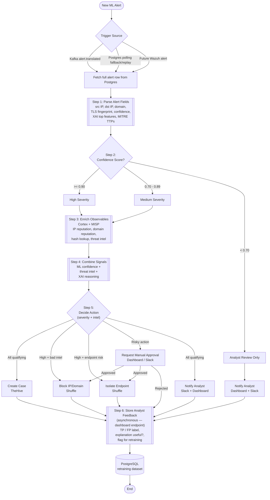

# SOAR Workflow Specification
**Module:** `services/soar_orchestrator`
**Purpose:** Orchestration logic that consumes annotated ML alerts and drives the SOAR response stack (TheHive, Cortex+MISP, Shuffle, optionally Wazuh).
**Audience:** Claude Code (implementation), Shuffle (workflow import reference).

---

## 1. Overview

The SOAR module consumes annotated detection alerts and orchestrates enrichment, case
management, and response actions. The orchestration logic is implemented in two layers:

1. **`soar_orchestrator` service** (Python) — consumes the detection-side Kafka
   `alert.translated` pointer event for low-latency triggers, fetches the full alert from
   the shared PostgreSQL `alerts` table, applies severity logic, calls Cortex/MISP,
   creates TheHive cases, runs the §5 decision matrix, persists state, and hands the
   action directive to Shuffle. PostgreSQL polling remains enabled for fallback/replay.
2. **Shuffle workflow** — visual automation for response actions (block, isolate, notify)
   and the manual approval gate.

This document specifies the end-to-end logic. The decision matrix in **Section 5** is
authoritative — implement those rules exactly.

### Deployment topology (current)

The two halves run on **separate machines** and integrate through a durable Postgres
contract plus a thin Kafka trigger:

- **Detection machine** — runs the producer/inference/translator pipeline and **owns the
  Postgres** (`alerts` table). Postgres publishes `5432`, firewalled to the SOAR host. The
  translator writes the full row first, then publishes `alert.translated` to Kafka topic
  `SOAR_ALERT_EVENTS_TOPIC` (default `soar_alert_events`).
- **SOAR machine** — runs `soar_orchestrator` alongside the vendored TheHive/Cortex/MISP/
  Shuffle stacks (`deploy/soar/`, managed by `scripts/soarctl.sh`). The orchestrator
  consumes the Kafka pointer, reads the detection Postgres **cross-machine**
  (`DATABASE_URL → <DETECTION_HOST>:5432`), and reaches the local SOAR stack over the host's
  published ports. It is **not** part of the detection compose; start it with
  `scripts/soarctl.sh start orchestrator`. See `deploy/soar/orchestrator/README.md`.

---

## 2. Component Roles

| Component | Role |
|---|---|
| **Translator service** | Produces annotated alert: confidence, XAI top features, MITRE TTPs, observables. Source of the trigger. |
| **soar_orchestrator** | Parses alert, applies severity logic, calls Cortex, creates TheHive cases, persists state. |
| **TheHive** | Case management — one case per qualifying alert, with tasks and observables. |
| **Cortex + MISP** | Observable enrichment — IP/domain reputation, hash lookup, threat intel correlation. |
| **Shuffle** | Now a **recorder/visualizer** of the actions directive (records + callback). Enforcement, notify, and the approval gate moved to the orchestrator; the Shuffle User-Input gate is **retired**. See §7.2. |
| **Wazuh** (manager-only here) | **Live** — the on-demand Active-Response channel. Manager runs on the SOAR host (`deploy/soar/wazuh-manager`); the endpoint agent runs the vetted `soar-block`/`soar-isolate` scripts. Routes real block/isolate to the exact host that produced a flow. |
| **Dashboard** | Analyst interface — notifications, manual approval responses, and feedback labelling (Step 6). Step 6 currently lands on the orchestrator's interim `/soar/feedback` endpoint pending the dashboard owning it. |
| **PostgreSQL** | Persistent store — alerts, enrichment results, analyst decisions, retraining labels. **Owned by the detection machine**; the orchestrator reads/writes it cross-machine. |

---

## 3. Trigger

**Current implementation: Kafka-triggered, Postgres-backed.** The translator writes the
full enriched alert row to PostgreSQL first, then publishes a thin Kafka pointer event to
`SOAR_ALERT_EVENTS_TOPIC` (default `soar_alert_events`):

```json
{
  "schema_version": "1.0",
  "event_type": "alert.translated",
  "alert_id": 123,
  "flow_id": "...",
  "model": "XGBoost",
  "tier": "fast",
  "translated_ts": "2026-06-19T...",
  "mapping_status": "mapped",
  "pred_label": 1,
  "pred_proba": 0.97
}
```

The orchestrator validates `schema_version == "1.0"` and `event_type ==
"alert.translated"`, then fetches the full row from Postgres by `alert_id`. Kafka is only
the low-latency trigger; Postgres remains the audit/replay/state source of truth.

**Fallback/replay:** the Postgres polling path remains active. On each loop the
orchestrator still calls `pick_next_alert(...)` for rows not present in
`soar_orchestrator_bookkeeping`, so missed Kafka events or historical rows can be replayed.
Both Kafka and polling share one idempotency gate: `claim_alert_for_processing(...)` inserts
one bookkeeping row per `alert_id`; duplicates are logged and skipped before TheHive or
Shuffle are called.

(Wazuh is **not** a trigger source here — the trigger is always the Postgres/Kafka alert.
Wazuh is used downstream as the endpoint **enforcement** channel; see §9.)

---

## 4. Workflow Steps

### Step 1 — Parse Alert Fields

**Source of truth = the shared PostgreSQL `alerts` table** (written by the translator, one
row per flagged flow where `model='XGBoost' AND tier='fast'`). Field names below are the
actual column names — read them directly; do not rename. Full contract + producer-side
detail in `context/SYSTEM_OVERVIEW.md`.

- `flow_id` — flow identity
- `pred_proba` — **this is `model_confidence`**, P(malicious) ∈ [0,1] (drives Step 2)
- `pred_label` — 0 benign / 1 malicious
- `observables` (JSONB) — `[{type, value, role}]`; `type ∈ {ip, domain, url, ja3}`,
  `role ∈ {src, dst}`. **`ja3`** carries the TLS client fingerprint (NFStream
  `client_fingerprint`); `server_fingerprint` (JA3S) may also appear. Route to Cortex/MISP
  by `type` (see Step 3). The orchestrator normalizes and deduplicates observables before
  enrichment/case creation, and by default skips non-global IPs (`SKIP_PRIVATE_IP_OBSERVABLES=true`).
- `top_k_json` (JSONB) — `xai_top_features`: top-k `[{feature, value, contribution, direction}]`
- `mitre_ttps`, `mitre_names` (JSONB) — mapped ATT&CK technique IDs / names
- `mapping_confidence` (float), `mapping_status` (`mapped`/`unmapped_heuristic`/`unmapped`),
  `mapping_version` — **trust signal for the feature→TTP mapping** (used in Step 4)
- `severity`, `severity_label` — translator's *advisory* severity (see Step 2)
- `annotation` — human-readable SOC explanation

### Step 2 — Severity Classification
The **orchestrator is the authoritative source of severity**, derived from `pred_proba`
(`model_confidence`). The translator's `severity_label` column is *advisory only* — do not
branch on it; recompute here so there is a single source of truth:

| `pred_proba` (model_confidence) | Severity |
|---|---|
| `>= 0.90` | **High** |
| `0.70 – 0.89` | **Medium** |
| `< 0.70` | **Analyst review only** |

> Note: the translator currently labels severity with a different threshold (≥0.85 = HIGH).
> That mismatch is intentional/known — the orchestrator's thresholds above win.

### Step 3 — Enrich Observables (Cortex + MISP)
For High and Medium severity only. Iterate `observables` and route each to its analyzers
by `type` (analyzer lists are in `integration_config.py`):
- `ip` → IP reputation (src and dst)
- `domain` → domain reputation
- `url` → URL analyzers
- `ja3` → **TLS-fingerprint correlation** (MISP `ja3-fingerprint-md5`; malware families
  reuse client JA3s, so this catches encrypted C2 even when IP/domain are clean/rotating)
- file hash, if present → hash lookup
- MISP threat-intel correlation across all of the above

Record the enrichment verdict: `intel_malicious` (bool) and `intel_score`.

**Implementation note:** enrichment is now run directly against Cortex/MISP before
TheHive case creation so the Step 5 decision and the initial case payload include
intel verdicts. The pre-case wait is bounded (`CORTEX_PRE_CASE_WAIT_SEC`, falling back to
`CORTEX_WAIT_SECONDS`; current default is short, so slow analyzers may still appear as
`pending` in the initial case). After the case is created, the orchestrator attaches
observables and posts a completed "Cortex Enrichment Summary" task with the verdict recap.
The initial TheHive case description also includes markdown tables for alert summary,
Cortex/MISP verdicts, SOAR actions, translator annotation/evidence, mapping reason, and top
XAI evidence.

**Analyst-review-only (Low) alerts skip enrichment** — they go straight to notification.

### Step 4 — Combine Signals
Compute a combined decision input from:
- `model_confidence` (ML signal)
- `intel_malicious` / `intel_score` (threat intel signal)
- `xai_top_features` + `mitre_ttps` (explanation context)
- `mapping_confidence` / `mapping_status` (**mapping trust signal**) — when
  `mapping_status != "mapped"` or `mapping_confidence` is low, treat the assigned
  `mitre_ttps` as tentative: surface them in the case but do not let an unvalidated TTP
  alone justify an automated block.

This combined view drives Step 5.

### Step 5 — Decide Action
Apply the **Decision Matrix** below. This is authoritative.

### Step 6 — Store Analyst Feedback (asynchronous)
**This is NOT part of the Shuffle detection workflow.** It is a separate endpoint, invoked
later when an analyst reviews the alert. Persists:
- `true_positive` / `false_positive` label
- `explanation_useful` (bool)
- `flag_for_retraining` (bool)

This data feeds the retraining dataset.

**Current implementation:** a minimal `POST /soar/feedback` route on the orchestrator's
`api_server` writes to an **interim** orchestrator-owned table (`soar_analyst_feedback`,
columns named to match the shared Step-6 schema). The shared `alerts` table now carries the
Step-6 columns (`explanation_useful`, `flag_for_retraining`, `true_positive/false_positive`);
the interim table will be retired once the **dashboard** owns Step 6 and writes those
columns directly. Step 6's real home is the dashboard — the orchestrator route is a stopgap.

---

## 5. Decision Matrix (Step 5 — AUTHORITATIVE)

| Severity | Cortex/MISP verdict | Actions |
|---|---|---|
| **High** | Malicious IOC confirmed | Auto-block IP/domain (Shuffle) + create case (TheHive) + notify (Slack + Dashboard) |
| **High** | No IOC confirmation | Create case (TheHive) + **request manual approval** before block/isolate + notify |
| **High** | Endpoint risk flagged (Wazuh) | Request manual approval for **isolate endpoint** + create case + notify |
| **Medium** | Any | Create case (TheHive) + notify (Slack + Dashboard). No automated block. |
| **Low** | (enrichment skipped) | Notify analyst only (Dashboard + Slack). No case, no response action. |

### Action definitions
- **Create case (TheHive)** — orchestrator calls TheHive API, attaches observables, MITRE TTPs as procedures, and renders the playbook as tasks.
- **Auto-block IP/domain (Shuffle)** — Shuffle firewall/block-rule app. Fires automatically only in the High + confirmed-IOC case.
- **Isolate endpoint (Shuffle)** — Shuffle containment app. **Always gated behind manual approval.**
- **Notify (Shuffle)** — Slack message + dashboard notification.
- **Request manual approval (Dashboard)** — see Section 6.

---

## 6. Manual Approval Gate — dashboard-mediated (CRITICAL implementation note)

Risky actions (**block**, **isolate**) must NOT fire automatically except in the single
auto-block cell defined in the matrix. All other block/isolate actions route through a
**human approval** step.

**The gate is the dashboard approval loop (the Shuffle User-Input gate is retired).** When a
gated action is decided on a **managed endpoint** (the alert carries a Wazuh `agent_id`), the
orchestrator parks it in the shared Postgres table **`soar_pending_approvals`** (status
`pending`, with a TTL). Then:
1. The **dashboard** lists pending approvals (reads the table) with alert context + the
   TheHive case link, the target host (`agent_id`/`host_id`), and—for block—the target IP.
2. The analyst clicks **Approve** / **Reject**.
3. The dashboard `POST`s the decision to the orchestrator: **`POST /soar/approve`**
   (`{approval_id, decision, analyst, note}`, **token-gated** via `SOAR_APPROVAL_TOKEN`).
4. On **approve** → the orchestrator runs the **real Wazuh Active-Response** on the agent
   (`wazuh_response.block`/`isolate`) and marks the row `executed`/`failed`.
5. On **reject** → the row is marked `rejected` (analyst + note); **no enforcement** (this is
   the "reject → log, skip" the old Shuffle gate could not do).

The claim is atomic (`pending → deciding`) so two concurrent approvals can't double-execute,
and rows **auto-expire** after `APPROVAL_TTL_SEC` (cannot be executed once expired).

> **Why the Shuffle User-Input gate was retired:** it was binary — *reject* aborted the whole
> run (no in-workflow rejection log) — and it left gated Shuffle runs paused indefinitely once
> approval moved to the dashboard. The dashboard loop fixes both. The Shuffle workflow now
> just records the directive (visualization/audit) and never gates.

Do not generate a fully automated flow with no human gate for isolate actions — isolate is
**always** gated and only ever enforced via an approved `/soar/approve`.

---

## 7. Implementation Boundaries (for Claude Code)

- **Synchronous detection workflow:** Steps 1–5 run in one pass when an alert arrives.
- **Asynchronous feedback:** Step 6 is a separate dashboard endpoint writing to PostgreSQL. It may be invoked hours after detection. Do NOT make the Shuffle workflow wait for it.
- **soar_orchestrator owns:** alert parsing, severity logic, Cortex calls, TheHive case creation, persistence.
- **Shuffle owns:** block, isolate, notify actions, and the approval pause gate.
- **The orchestrator triggers Shuffle** via Shuffle's **workflow-run API**, not a webhook:
  `POST {SHUFFLE_BASE_URL}/api/v1/workflows/{SHUFFLE_WORKFLOW_ID}/run` with header
  `Authorization: Bearer {SHUFFLE_API_KEY}` and the §7.1 payload as the JSON-string
  `execution_argument`. (A webhook trigger was evaluated but its activation couldn't be
  confirmed headlessly; the `/run` API was verified end-to-end against the live instance.)
  Config lives in the orchestrator `.env` (`SHUFFLE_BASE_URL`, `SHUFFLE_WORKFLOW_ID`,
  `SHUFFLE_API_KEY`). The importable workflow + notes are in
  `services/soar_orchestrator/shuffle/`.

---

## 7.1 Orchestrator → Shuffle Handoff Payload (AUTHORITATIVE)

This is the contract for the chosen architecture: the orchestrator runs Steps 1–4 and the
decision matrix (Step 5), creates the TheHive case, then hands this payload to Shuffle via
the workflow-run API (§7, as the `execution_argument`). **Shuffle executes the `actions`
directive as given — it does NOT re-derive severity, re-run the matrix, or re-run Cortex.**
The orchestrator is the single source of truth for the decision; Shuffle is the action layer.

The payload also carries flat, top-level **action-hint booleans** (`block_present`,
`block_requires_approval`, `isolate_present`, `isolate_requires_approval`, `notify_present`),
derived from `actions`, purely so Shuffle's branch nodes have simple booleans to route on
instead of parsing the `actions` array. `actions` stays authoritative — the hints are always
recomputed from it.

```jsonc
{
  "schema_version": "1.0",
  "alert": {
    "flow_id": "…",
    "severity": "High | Medium | Low",
    "model_confidence": 0.94,          // = pred_proba
    "mitre_ttps": ["T1071", "T1071.001"],
    "mapping_status": "mapped",        // mapped | unmapped_heuristic | unmapped
    "mapping_confidence": 0.87,
    "annotation": "…",                 // SOC explanation for approval/notify context
    "intel": { "intel_malicious": true, "intel_score": 0.0 }  // Cortex/MISP verdict (Step 3)
  },
  "case": {                            // TheHive case already created by the orchestrator
    "thehive_case_id": "~12345",
    "thehive_case_url": "https://thehive/cases/~12345"
  },
  "observables": [                     // enriched; used as block targets + approval/notify context
    { "type": "ip",     "value": "203.0.113.7", "role": "dst", "intel_malicious": true },
    { "type": "domain", "value": "bad.example",  "role": "dst" },
    { "type": "ja3",    "value": "e7d705a3286e19ea42f587b344ee6865" }
  ],
  "endpoint": {                        // present only when Wazuh/endpoint risk drives isolate
    "host_id": "agent-014", "ip": "10.0.0.14", "source": "wazuh"
  },
  "actions": [                         // AUTHORITATIVE — emitted from the §5 decision matrix
    { "type": "block",   "targets": [{ "type": "ip", "value": "203.0.113.7" }], "requires_approval": false },
    { "type": "isolate", "target": { "host_id": "agent-014" },                  "requires_approval": true  },
    { "type": "notify",  "channels": ["slack", "dashboard"],                    "requires_approval": false }
  ],
  // Flat hints derived from `actions` (Shuffle branch convenience; actions stays authoritative)
  "block_present": true,
  "block_requires_approval": false,
  "isolate_present": true,
  "isolate_requires_approval": true,
  "notify_present": true,
  // Shuffle POSTs action outcomes back here (/soar/shuffle-result). Set from
  // SOAR_CALLBACK_BASE_URL — must be reachable from the Shuffle worker, so it is the
  // SOAR host's published address, e.g. http://<SOAR_HOST>:8200, not a container name.
  "callback_url": "http://<SOAR_HOST>:8200/soar/shuffle-result"
}
```

### Shuffle's role now — record + callback (the gate is retired)
Enforcement, notify, and the approval gate are all **orchestrator-owned** (see §7.2). Shuffle
is now a **recorder/visualizer**: its `parse` node always routes to `execute_direct`, which
records the directive and POSTs a result summary (`{flow_id, thehive_case_id, results[]}`) to
`callback_url` (`/soar/shuffle-result` → `soar_shuffle_results`). It no longer gates — the
old User-Input pause is unreachable. (All logic runs in **Shuffle Tools `execute_python`**
nodes; the callback uses `urllib` because the `http` app worker is not deployed in the swarm.)
The matrix still lives only in the orchestrator; `requires_approval` on each action is honoured
by the orchestrator (auto vs dashboard-approval), not by Shuffle.

---

## 7.2 Response actions — real enforcement via Wazuh (current state)

`block`/`isolate` are enforced for real on the **endpoint** via **Wazuh on-demand
Active-Response**, when the alert carries a managed-endpoint identity (`agent_id`):

- **`notify`** → real Slack message (orchestrator `notify_client.py`, `SLACK_WEBHOOK_URL`) +
  the dashboard surfaces (DB). Always runs, never gated.
- **Auto-block** (High + confirmed IOC, `requires_approval: false`) → the orchestrator
  immediately calls `wazuh_response.block(agent_id, dst_ip)` → manager `PUT /active-response`
  → the agent's `soar-block` script drops egress to the malicious IP. (No agent ⇒ skipped.)
- **Gated block / isolate** (`requires_approval: true`) → parked in `soar_pending_approvals`
  for the §6 dashboard approval loop; on approve the orchestrator runs the real
  `wazuh_response.block`/`isolate`. `isolate` preserves the agent↔manager channel.
- **Replay / in-stack flows** (no `agent_id`) → no endpoint enforcement; notify + case only.

The Shuffle node's recorded `{enforced:false, placeholder:true}` entries are **only a
visualization/audit trail** now — the authoritative enforcement is the orchestrator→Wazuh
path above. The endpoint agent + the four vetted AR scripts (`soar-block`/`unblock`/`isolate`/
`unisolate`) are detection-repo-owned (`endpoint_agent/`); the manager + dispatcher are
SOAR-side (`deploy/soar/wazuh-manager`, `services/soar_orchestrator/wazuh_response.py`).

---

## 8. Reference Flowchart



> Flowchart caveats vs. the implementation: Kafka is only the low-latency trigger; the
> orchestrator always fetches the full row from Postgres and polling remains a replay/fallback
> path. The approval step is the **dashboard loop** (`soar_pending_approvals` +
> `POST /soar/approve` → real Wazuh AR), not a Shuffle pause (§6, retired). Step 6 currently
> lands on the orchestrator's interim `/soar/feedback` route, not yet the dashboard.

---

## 9. Wazuh — the endpoint enforcement channel (LIVE, manager-only)

Wazuh is now the **actuator** for endpoint-routed block/isolate, used **on demand** (not
rule-driven). Deployment + flow:
- **Manager-only** on the SOAR host (`deploy/soar/wazuh-manager`; no indexer/dashboard, to fit
  memory). Registers the four AR `<command>`s. Ports: 1515 (enroll), 1516→1514 (agent comms),
  55000 (API).
- **Endpoint agent** (detection-repo `endpoint_agent/`) = NFStream sensor + Wazuh agent + the
  vetted `soar-block`/`unblock`/`isolate`/`unisolate` scripts; enrolled to the manager.
- **Endpoint identity** rides the contract: the sensor stamps `agent_id`/`host_id`/`host_ip`
  onto the flow → `alerts` row → the §7.1 `endpoint` object. `endpoint_risk = bool(agent_id)`
  now makes the (always-gated) isolate cell real.
- **Dispatch**: orchestrator `wazuh_response.py` authenticates + `PUT /active-response?
  agents_list=<agent_id>` `{"command":"!soar-block","arguments":["<dst_ip>"]}`. Auto-block
  fires immediately; gated block/isolate fire on approval (§6). No `agent_id` ⇒ skipped
  (replay/in-stack flows get notify + case only).

Defense in depth is on the agent: the AR scripts validate the IP, refuse RFC1918/own-infra,
log to `active-responses.log`, auto-expire blocks, and keep the manager channel alive on
isolate.

---

## 10. Current Implementation Status (snapshot)

| Area | Design intent | Current state |
|---|---|---|
| **Trigger** | new-alert webhook / event | ✅ Kafka `alert.translated` trigger fetches full row from Postgres; polling remains fallback/replay (`pick_next_alert`) |
| **Deployment** | one box | ✅ split: detection owns Postgres; SOAR runs orchestrator + stack, reads DB cross-machine (`scripts/soarctl.sh start orchestrator`) |
| **Step 2 severity** | recompute from `pred_proba` (≥0.90 / 0.70–0.89 / <0.70) | ✅ `severity.py`; `severity_label` advisory only |
| **Step 3 enrichment** | Cortex + MISP by observable type; `ja3` → MISP | ✅ runs before case creation with normalized/deduped observables and private-IP skipping; bounded wait can leave slow jobs `pending`; summary is posted into the case afterward |
| **Step 4 mapping trust** | tentative TTP can't justify auto-block | ✅ `mapping_trust.py`; not an input to the auto-block cell |
| **Step 5 matrix** | §5, authoritative | ✅ `decision_matrix.py` (auto-block only High + confirmed IOC; isolate always gated) |
| **TheHive case** | one case per qualifying alert | ✅ created after Step 3/4 enrichment and Step 5 decision; description uses markdown tables for summary/intel/actions/annotation/evidence; Low = notify-only, no case |
| **Handoff to Shuffle** | push payload | ✅ Shuffle **`/api/v1/workflows/{id}/run`** API (not webhook) + flat action hints; Shuffle is now record-only |
| **Notify** | Slack + dashboard | ✅ real Slack (`notify_client.py`, `SLACK_WEBHOOK_URL`), fail-soft; dashboard via DB |
| **Block (endpoint)** | drop egress to C2 | ✅ **real Wazuh AR** — auto-block fires immediately on High+confirmed-IOC for a managed endpoint; no `agent_id` ⇒ skipped |
| **Isolate (endpoint)** | always gated | ✅ emitted for managed endpoints; enforced via the approval loop (real `soar-isolate`, keeps manager channel) |
| **Approval gate** | pause; approve→exec, reject→log+skip | ✅ **dashboard loop**: `soar_pending_approvals` + token-gated `POST /soar/approve` → real Wazuh AR on approve; logged reject; TTL expiry. Shuffle User-Input gate **retired** |
| **Callback** | Shuffle → `/soar/shuffle-result` | ✅ `urllib` POST from `execute_python` (http app worker not deployed) → `soar_shuffle_results` |
| **Step 6 feedback** | dashboard endpoint | ⚠️ interim `POST /soar/feedback` on the orchestrator → `soar_analyst_feedback` (migrate to shared columns when dashboard owns it) |
| **Wazuh manager** | enforcement channel | ✅ manager-only deployed (`deploy/soar/wazuh-manager`), AR commands registered, API reachable from orchestrator |
| **Dashboard approval surface** | analyst approve/reject UI | ⏳ SOAR side ready (`soar_pending_approvals` + `/soar/approve`); the dashboard list/buttons are a detection-side build |

Legend: ✅ implemented · ⚠️ implemented with a documented gap · ⏳ contract ready, other-side build pending.

---

## 11. Operational Helpers / Current Tunables

- `scripts/delete_cortex_jobs.sh` deletes Cortex jobs via the Cortex API in repeated batches.
  It skips API shape assumptions (`id`/`_id`) and reports failures; Cortex may still retain
  `Deleted` history rows in the backend/UI.
- `scripts/delete_thehive_cases.sh` deletes TheHive cases in batches; it is dry-run by
  default and requires `--yes` to actually delete.
- Job-volume controls live in `services/soar_orchestrator/.env`:
  `MAX_OBSERVABLES_PER_FLOW`, `MAX_CORTEX_RUNS_PER_FLOW`, analyzer lists, and
  `SKIP_PRIVATE_IP_OBSERVABLES`.
- Initial case `pending` analyzer rows usually mean the bounded pre-case wait expired, not
  that enrichment was skipped. Increase `CORTEX_PRE_CASE_WAIT_SEC` if the initial case must
  wait longer for completed reports.
